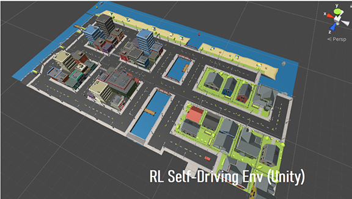
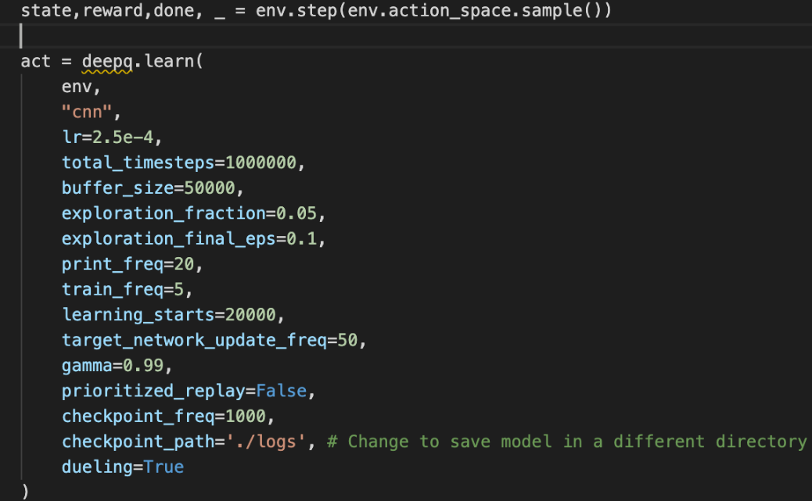

# RL Simulation Environment Implemented Using Unity



## What is this?

This is a game environment designed for Reinforcement Learning/Imitation Learning tasks. It is implemented using the 3D game engine Unity.

## How to Run it?

For people who wants to test their RL algorithms, you can download the _build_ folder, and use without any further configurations. If you want to have more freedom in customizing the scene, for example, different routes, rewards settings, sensor numbers, please clone this repository and open it in Unity(2020.1.14f1). The _Library_ folder is not included in this repository.

You can test the game by executing the **RLCar.exe** file in the _build_ folder.

## Which Platform?

This game is built using Windows 10. Please use Windows(32/64 bit) if you want to directly run the executable. You can also build for other platforms using Unity.

## Connect to Python?

We offer gym-like APIs in python 3. We recommend using Python 3.6 or above to interact with this environment.

Please install these dependencies before connecting.

```
pip install gym-unity==0.22.0 mlagents-envs==0.22.0
```

Include these libraries in Python.

```
from mlagents_envs.environment import UnityEnvironment
from gym_unity.envs import UnityToGymWrapper
```

You can connect the Unity environment using the binary executable file:

```
unity_env = UnityEnvironment("build\RLCar.exe")
env = UnityToGymWrapper(unity_env,0)
```

Or run it in the Unity Engine play mode:

```
unity_env = UnityEnvironment(base_port=5004)
env = UnityToGymWrapper(unity_env,0)
```

The APIs are similar to the gym.



## Related Projects

Please check for the projects which uses this game environment.
